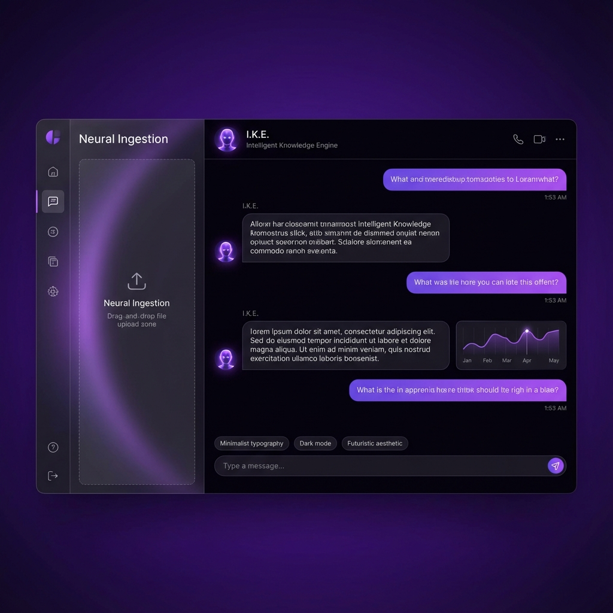

# I.K.E. Presentation Layer
**Project: I Know Everything You Tell Me**

## 🧬 Conceptual Framework
I.K.E. is designed as a "Brain-Extension" rather than just a chatbot. The core design philosophy centers on **Transparency** and **Speed**.

### 🎨 Visual Identity: Midnight Violet
The UI uses a custom color palette designed for high-focus internal work.
- **Primary**: `hsl(265, 89%, 66%)` - Vibrant Purple (Neural Activity)
- **Background**: `hsl(260, 20%, 4%)` - Deep Void (Focus)
- **Accent**: `hsl(240, 10%, 15%)` - Dark Glass (Structure)

## 🖥️ UI Architecture
The layout is optimized for wide-screen neural exploration:
1.  **Sidebar (Left)**: The 'Input' side. Contains the **Neural Ingestion** zone and **Active Model** stats.
2.  **Main Stage (Center)**: The 'Output' side. High-contrast bubbles with syntax highlighting.
3.  **Input Bar (Bottom)**: Minimalist command center with neon focus glows.

### Mockup Preview

## 🏢 Business Use Cases

| Industry | Implementation | Value Add |
| :--- | :--- | :--- |
| **Healthcare** | Local indexing of patient history logs. | 100% HIPAA compliance (no cloud). |
| **Finance** | Quarterly report cross-referencing. | Identifying trends across 10 years of PDFs. |
| **Gaming** | Game Design Document (GDD) management. | Keeping vast lore consistent for writers. |
| **Legal** | Case law synthesis. | Rapidly finding precedents in uploaded binders. |

## 🏗️ Technical Stack
- **Web**: Next.js 14, Tailwind, Framer Motion.
- **Engine**: FastAPI, LangChain.
- **Memory**: Qdrant Vector Database.
- **Inference**: Ollama (Llama 3).
